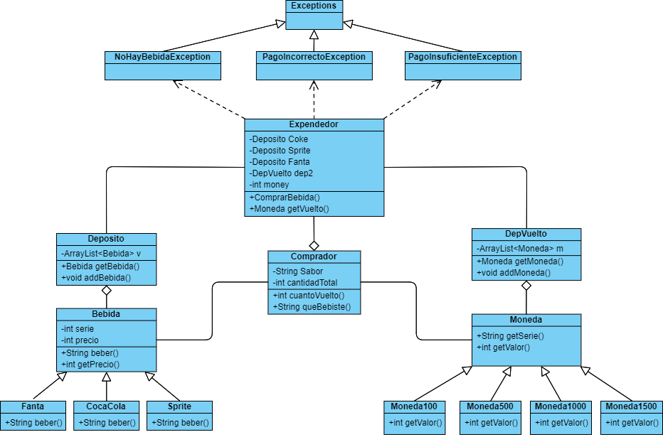

# homework_2  

## Integrantes  

- Daniela Alejandra Novoa Opazo
- Jorge Ignacio Santis Martinez   
 
  Bienvenidos a nuestra tarea número 2, donde encontrará 3 branches dentro del inicio: main, avancesIniciales y avancesFinales.   
  En main está el trabajo finalizado separado en 8 archivos Java (7 clases y 1 main, "Maquina"), mientras que como sus nombres señalan los avances que hicimos al principio de la tarea tales como las primeras creaciones de clases y métodos, y los avances cercanos a la tarea finalizada se encuentran respectivamente en avancesIniciales y avancesFinales.  
  Esta tarea fue realizada asignando partes  de trabajo equitativas a ambos integrantes.  
  En último lugar dejamos una foto del UML de nuestro trabajo, imagen que también encontrará en los archivos de este repositorio.
  
  
